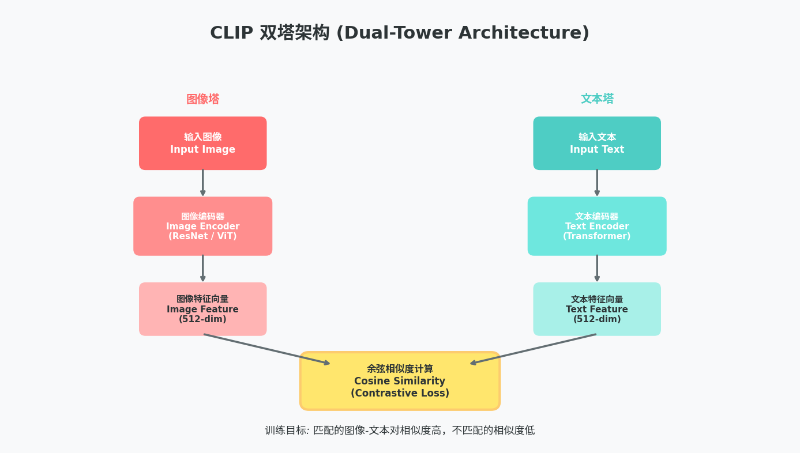

# 7.30周报

#### 一、对《基于视觉语言大模型的多标签零样本学习方法的研究》这篇论文进行了巩固和重新梳理。

1. 第一章 绪论：背景→国内外现状→现存挑战→本文研究内容+创新点→全文章节安排

2. 第二章 相关理论与技术基础：领域核心概念、基础模型、关键技术拆解（相当于文献综述基础部分）

3. 第三章 第一个核心创新算法（解决第一个痛点）：问题定义→模型架构→模块设计→损失函数→数据集/实验/消融

4. 第四章 第二个递进创新算法（解决更深层痛点，与第三章形成递进关系）：承接第三章不足，提出细化优化方案，同套实验验证流程

5. 第五章 工程原型系统实现：算法落地，完成GUI软件，证明方法具备实用价值

6. 第六章 总结与展望：全文工作总结、3条以内核心创新、现存局限、未来拓展方向

   

#####         问题分层拆解：不做“大而空”研究，把领域大难题拆成两个递进子问题

1、 第一层痛点：单模态提示学习造成可见类过拟合、可见/不可见性能失衡→第三章MDPL多模态解耦提示学习

2、 第二层痛点：全局特征混合、细粒度图文对齐差→第四章双重图文对齐方法

3、 理论+工程双结合：既有算法创新（理论贡献），又做可视化系统（工程落地），满足“理论+实践”双标准

#### 二、对该篇论文涉及到的多模态基础模型CLIP进行了进一步的学习

##### 1、CLIP的解决思路

"用文本描述来监督图像学习"
CLIP 从互联网上爬取了 4 亿对 (图像- 文本) 数据（比如一张猫的图片配一段文字 "a photo of a cat sitting on a sofa"），让模型学习"图像和对应文本应该相似，和不对应文本应该不相似"这个简单但强大的规律。

##### 2、模型架构：双塔结构

图像编码器
   • 可以是 ResNet
   • 也可以是 Vision Transformer (ViT)
   • 将输入图像编码为一个固定维度的特征向量
文本编码器
   • 采用标准的 Transformer 架构
   • 将输入文本编码为与图像相同维度的特征向量
关键设计
   两个编码器输出的向量维度相同（如 512 维或 768 维)，这样可以直接计算余弦相似度。

##### 3、训练方式：对比学习

训练过程：
假设一个 batch 有N对 (图像, 文本)：

1. 前向传播：

    N张图片经过图像编码器 →  N个图像向量
    N段文本经过文本编码器 → N个文本向量

2. 构建相似度矩阵：
    计算所有图像向量与所有文本向量的点积，得到一个NXN的矩阵

3. 对比损失（InfoNCE Loss）：
    对角线上的N对是正样本（图像和文本匹配），相似度应该高
    非对角线上的$N^2 - N$对是负样本（图像和文本不匹配），相似度应该低
    损失函数同时优化图像→文本和文本→图像两个方向的分类

##### 4、推理方式：零样本分类

训练完成后，CLIP 可以不做任何微调，直接用于新任务：
步骤：

1. 构建提示模板：将类别名称变成自然语言描述
    比如类别是 "dog"，模板是 "a photo of a {label}"
    得到："a photo of a dog", "a photo of a cat", "a photo of a car"...
2. 编码文本：将所有提示文本输入文本编码器，得到每个类别的向量
3. 编码图像：将待分类图片输入图像编码器，得到图像向量
4. 计算相似度：图像向量与哪个类别文本向量最相似，就预测为哪个类别

