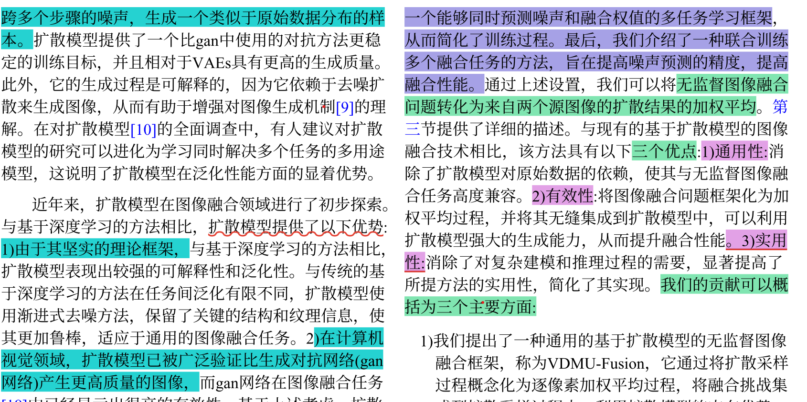

# 7.10

## 1、本周学习内容

一、精读《条件扩散模型-图像融合》论文，并制作汇报PPT。这篇论文针对无监督图像融合缺少真值、扩散模型难以直接落地的痛点，设计一套轻量化、通用的扩散融合框架：

1. 通过双分支同噪声数学假设，从理论上打通扩散模型与无监督融合，无需真值即可完成融合；

2. 多任务U-Net同时预测噪声与融合权重，简化训练流程；

3. 跨任务联合训练提升泛化能力，单模型统一处理红外可见光、医学、多曝光、多对焦四类融合；

4. 适配带噪扩散中间图的专用损失函数，消除采样随机性，稳定输出高质量融合图像。

二、力扣数组专题，掌握切片操作和双指针模板

三、小土堆PyTorch教程学习、包含Tensor、Dataset等基础

## 2、下周学习计划

1、继续编程内容的学习

2、通过老师给的论文学习硕士论文的写作方法