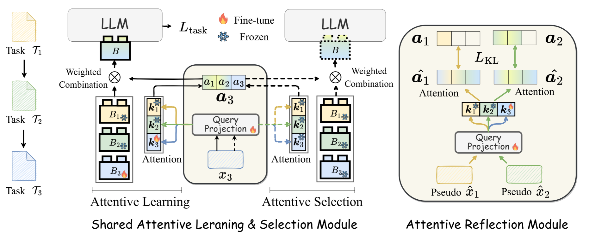
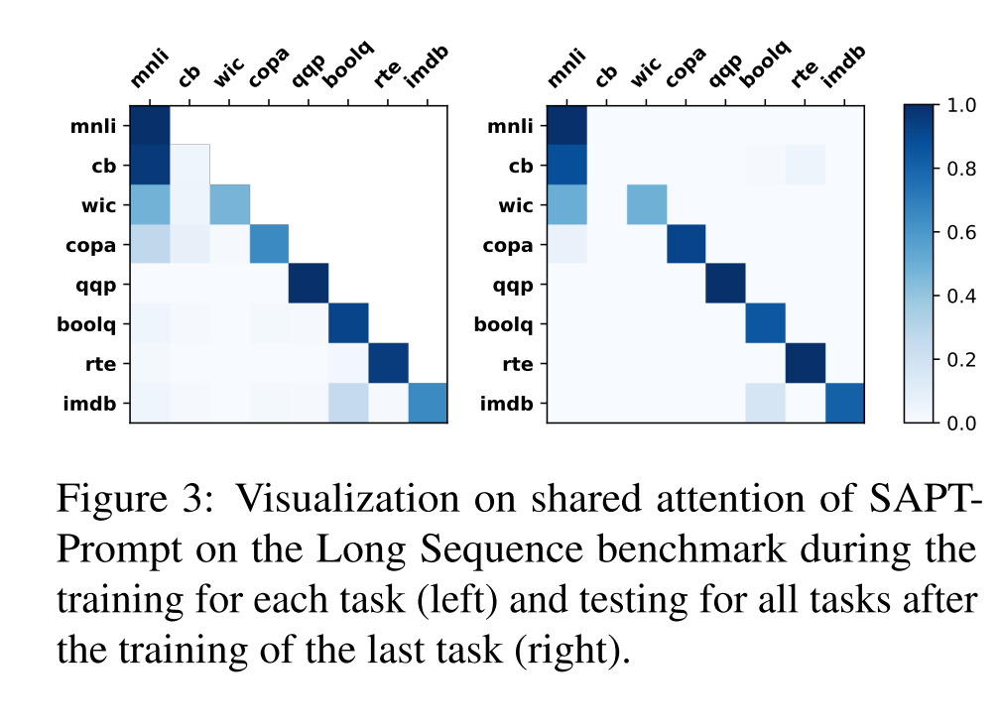
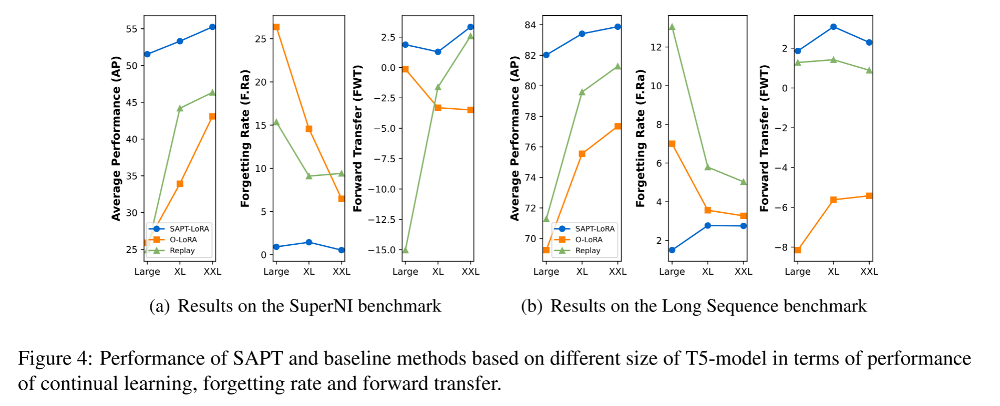
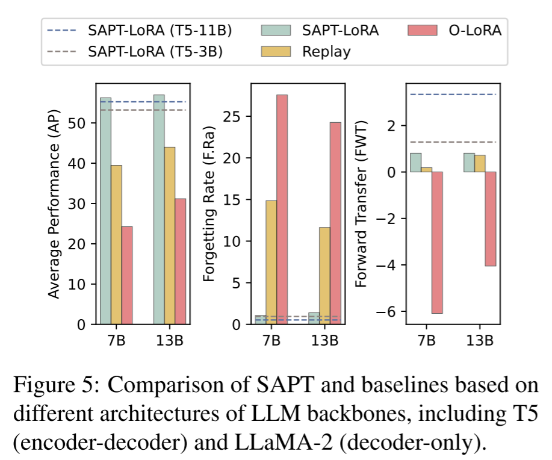

# 本周学习内容

## 一、阅读《SAPT：大型语言模型参数高效持续学习的共享注意框架》

#### 1、研究背景与痛点

随着大语言模型被部署到真实世界，它们需要不断学习新的任务，例如：

- 新的问答任务
- 情感分析
- 对话生成
- 信息抽取
- 文本摘要等

但是，LLM在持续学习时面临两个关键问题：

  1、灾难性遗忘（CF）：学新任务时丢失旧任务知识

  2、知识迁移（KT）：利用旧任务知识辅助新任务学习

现有PET（LoRA/Prompt)增量学习方法存在缺陷：

  1、学习模块：各任务PET模块相互隔离正交，阻断跨任务知识迁移

  2、选择模块：测试时简单求和、拼接PET、固定池选取，极易遗忘旧任务

核心短板：学习、选择两个模块完全割裂，无法同时兼顾防遗忘与知识迁移，且多数方法依赖测试时提供任务ID,不符合真实落地场景。

#### 2、核心方案：SAPT共享注意力框架

提出SAPT，用同一套共享注意力对齐PET模块的训练学习和测试选择两大流程，包含两大核心模块：

1、SALS共享注意力学习选择模块：训练&推理复用完全相同的注意力计算逻辑：

Attentive Learning(训练)：新样本通过查询投影，和所有历史PET模块的key向量计算注意力权重，加权融合全部旧PET参数辅助当前任务训练，天然实现知识迁移;

Attentive Selection(推理)：无任务ID时，输入走一模一样的注意力流程，自动匹配、加权组合适配的PET模块，缓解遗忘

2、ARM注意力反映模块

连续更新查询投影层会破坏旧任务注意力分布，引发遗忘。ARM训练独立生成器产出仅含输入部分的伪样本，用KL损失约束旧伪样本的注意力权重，还原历史任务原本的注意力分布；相比传统回放方法，只生成输入、无需完整输入输出对，更高效、效果更好。

整体损失 = 当前任务监督损失 + 平衡系数λ × KL注意力约束损失。

#### 3、实验设置与结论

两大持续学习基准：1、SuperNI：15类多样生成任务（对话、抽取、摘要、Q&A、情感）2、Long Sequence:15个文本分类任务

评价指标：平均性能AP、遗忘率FP、前项迁移FWT、后向前移BWT

关键实验结果：

1. SOTA效果：SAPT-LoRA / SAPT-Prompt 在两个数据集上全面超越SeqLoRA、O-LoRA、ProgPrompt、LFPT5、EPI等主流PET增量学习基线，遗忘率极低、知识迁移能力最强；

2. 泛化性强：兼容T5（编码器-解码器）、LLaMA-2（纯解码器），模型规模覆盖770M~13B；对训练中未见过的全新任务，泛化性能大幅领先基线；

3. 消融验证：SALS的学习-选择对齐、ARM伪样本反思都是性能核心，去掉任意模块效果暴跌；ARM比传统真实样本回放、朴素伪样本回放更高效；

4. 注意力可视化：训练、测试注意力热力图高度一致，证明学习与选择流程成功对齐，跨任务权重体现知识迁移。

#### 4、总结与展望

本文主要贡献：

1、提出SAPT框架，通过共享注意力统一PET训练与选择，同时解决遗忘、知识迁移两大问题，适配无任务ID的真实场景；

2、ARM提出伪样本新用法：仅重建输入做注意力约束，相比传统回放更高效有效

3、充分验证通用性：兼容Prompt Tuning、LoRA两种PET方案，适配不同架构、尺寸大模型与未知新任务

未来展望：

1、任务数量极大时，PET模块池存储、计算开销上涨，需做模块剪枝合并

2、后向迁移仍为负值，无法让新任务正向提升旧任务性能

3、训练阶段仍需区分任务以分配独立PET，未来可研究无任务划分的流式持续学习

## 二、深度学习板块：

1、通过具体任务对“拟合”和“决策边界”有了物理层面的直观认知。

2、深刻理解“激活函数”的真正意义：没有非线性激活函数，无论叠多少层神经网络，本质上都是一个只能画直线的线性回归模型。

3、直观理解“网络容量”和“过拟合/欠拟合”

